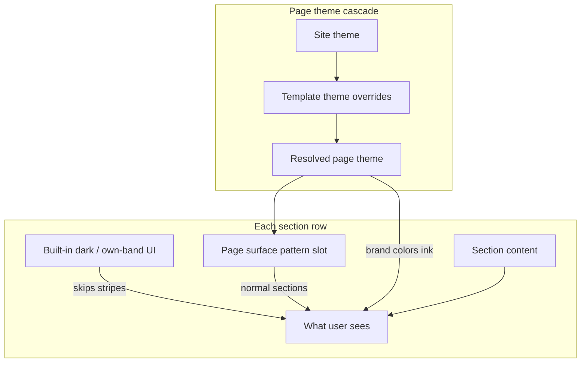

# CMS override guide — priority & how it works

> **In the CMS UI:** open **Themes** (`/cms/site-theme`) for the **How overrides work** panel, or click **Override guide** on a theme screen.

This guide explains **what wins when** you edit themes and section content in SkillHub CMS. Use it when you are unsure whether to change the **site**, a **page template**, or a **single section’s content**.

---

## Quick answer: highest priority first

| Layer | What it controls | Wins over |
|-------|------------------|-----------|
| **1. Built-in section paint** | Dark / full-bleed heroes, CTAs, etc. (fixed in code) | Page surface stripes |
| **2. Page template theme** | Colors + surface pattern for that template | Site theme |
| **3. Site theme (global)** | Default colors + surface pattern | — (base layer) |

For **section text, cards, buttons, and images**, priority depends on **content scope** (see Part 3).

Theme CMS is **Colors** + **Surface** only. Dark / full-bleed sections are owned in code (`SECTION_DARK_BG_KEYS`), not per-section theme fields.

---

## Part 1 — Page theme overrides

Page themes control **brand colors** and **section row surface patterns** (e.g. white → grey stripes).

### Cascade (low → high)

```
Site theme (global)
    ↓  empty fields inherit
Page template theme (home, product, course, …)
    ↓  empty fields inherit
Live page appearance
```

**Rule:** Only **non-empty** fields at a higher layer replace the layer below. Empty or “Inherit” means *use the parent*.

### Where to edit

| Goal | Where in CMS |
|------|----------------|
| Change defaults for the whole site | **CMS → Themes → Site theme (global)** |
| Change one template only (e.g. all product pages) | **CMS → Themes → Page template themes**, or **CMS → Pages → [template] → Theme tab** |
| Preview while editing a live entity page | **CMS mode → Theme tab** (saves template theme for that page type) |

### Theme editor tabs

The theme editor has **two** tabs. Both share one **Save** — you can switch tabs and save once.

| Tab | Fields | Inherit behavior (template level) |
|-----|--------|-----------------------------------|
| **Colors** | Preset, Brand, Brand hover, Ink | Empty = use site theme |
| **Surface** | Band pattern (repeat sequence / one color / transparent) | “Inherit” = use site pattern |

### What each theme field does

| Field | Effect on the live page |
|-------|-------------------------|
| **Brand / Brand hover / Ink** | CSS variables (`--brand`, `--ink`, etc.) used across buttons, links, and dark bands |
| **Surface pattern** | Default **section row backgrounds** for normal (non–full-bleed) sections. Builds repeating colors (e.g. white → grey → white → grey) |

### Template vs site — examples

- Site: white/grey alternating bands. Product template: **inherit** surface → product pages still alternate white/grey.
- Site: blue brand. Home template: set **Ink** only → home uses custom ink; brand colors still from site unless overridden.

**Reset template:** Use **“Use site theme only”** / **“Clear template overrides”** to remove all template-level theme fields.

---

## Part 2 — How section rows get their background

There is **no** per-section band CMS editor. What paints a row:

### Visual priority (highest → lowest)

```
1. Built-in section UI          ← heroes, CTAs, galleries listed in SECTION_DARK_BG_KEYS / own-band keys
2. Page surface pattern         ← Site + Template theme → Surface tab (white/grey, etc.)
3. Site / template Colors       ← brand + ink tokens used by dark/light copy
```

### Built-in dark / full-bleed sections

Some section types always paint their own background and **skip** page surface striping. The canonical list lives in code:

`client/src/lib/sections/theme/section-theme.data.ts` → `SECTION_DARK_BG_KEYS` (and related `SECTION_OWN_BAND_KEYS` / skip keys).

Examples: `cta_band`, `split_cta`, `hero_gradient_slider`, `vendor_link_grid`, `metric_rail`, …

**Tip:** Use the **Surface** tab for normal content rows. If a section must always be dark, that belongs in the section component + `SECTION_DARK_BG_KEYS` — not a CMS band override.

### Full-bleed / skip-stripe sections

Types such as `in_page_nav`, `promo_modal`, and keys in `SECTION_THEME_BAND_SKIP_KEYS` may skip the page band wrapper or only affect tokens. If a section looks “self-contained,” check its section type before fighting the surface pattern.

---

## Part 3 — Section content overrides

Section **content** (title, subtitle, items/cards, buttons, images) uses a separate rule: **`content_scope`**.

### Content scope levels

| Scope | Editable on | Locked on |
|-------|-------------|-----------|
| **Global** | Section catalog (`Content sections`) | Template placements & entity pages |
| **Template** | Page template placement | Entity pages (vendor/product/course detail) |
| **Page** | Template placement **and** entity page | — (full cascade) |

Legacy DB value `cascading` is treated as **Page**.

### Content resolution order (for `page` scope)

For each field (title, items, buttons, images, etc.):

```
Entity page override   (highest — this vendor/product/course only)
    ↓ if empty
Page template placement
    ↓ if empty
Section catalog default
```

For **`template` scope:**

```
Page template placement
    ↓ if empty
Section catalog default
(Entity page cannot change content)
```

For **`global` scope:**

```
Section catalog only
(All templates and entity pages use the same content)
```

### Where to edit content

| Scope | Edit here |
|-------|-----------|
| **Global** | **CMS → Content sections → [section key]** |
| **Template** | **CMS → Pages → [template] → placement**, or template section editor |
| **Page** | Entity CMS mode (gear on live page) for that record |

If editing is blocked, the UI will say content is **global** or **template**-locked and point you to the correct screen.

---

## Part 4 — How it fits together on a live page



**Example — Product detail page:**

1. **Site theme:** Brand blue, surface = white + grey repeat.  
2. **Product template theme:** Inherit everything → still white/grey.  
3. **Overview section:** Uses surface pattern → first band = white.  
4. **Features section:** Uses surface pattern → second band = grey.  
5. **CTA band:** Listed in `SECTION_DARK_BG_KEYS` → always dark (not from Surface tab).  
6. **FAQ items:** `content_scope = template` → same FAQ on all products; edit on product template, not per product.

---

## Part 5 — Decision cheat sheet

| I want to… | Do this |
|------------|---------|
| Change brand color site-wide | Site theme → **Colors** tab |
| Home page only uses a different band pattern | Home template theme → **Surface** tab |
| Alternate custom colors (no code) | Site or template theme → **Surface** → Repeat sequence → add colors |
| One section type is always dark | Implement in the section UI + add key to `SECTION_DARK_BG_KEYS` |
| Same testimonials on every page | Section catalog + `content_scope: global` |
| Different hero per vendor | `content_scope: page` + edit in that vendor’s CMS mode |
| Reset a template to site defaults | Clear template theme overrides |

---

## Part 6 — Common mistakes

| Mistake | Why it fails | Fix |
|---------|--------------|-----|
| Changed site theme but template has overrides | Template non-empty fields **win** | Clear template field or use Inherit |
| Looking for per-section band / bg image / bg color | Not in CMS | Use **Surface** for stripes; dark sections are code-owned (`SECTION_DARK_BG_KEYS`) |
| Looking for a theme Background tab | Not in CMS | Colors + Surface only |
| Edited FAQ on entity page, scope = template | Entity editor is **locked** | Edit on page template placement |
| Expected entity-only theme tab | Live CMS theme tab saves **template** theme | Use template theme for all pages of that type |

---

## Glossary

| Term | Meaning |
|------|---------|
| **Site theme** | Global defaults (`SiteTheme` in DB) |
| **Template theme** | `Page.theme` for a page key (`home`, `product`, …) |
| **Resolved theme** | `mergeTheme(site, template)` — what the page actually uses |
| **Surface pattern** | `surface_pattern` — repeating band colors on normal section rows |
| **Placement** | One section instance on a page template |
| **Entity override** | `EntityPageSection` — per vendor/product/course content changes |
| **content_scope** | Whether content is global, template-only, or per-entity |
| **SECTION_DARK_BG_KEYS** | Code list of sections that always paint their own dark/full-bleed band |

---

## Related files (for developers)

| Area | Code |
|------|------|
| Theme merge | `server/src/modules/cms/theme.utils.js` → `mergeTheme()` |
| Dark / own-band keys | `client/src/lib/sections/theme/section-theme.data.ts` |
| Placement surface resolve | `client/src/lib/sections/theme/section-theme.runtime.ts` → `computePlacementSurface()` |
| Surface pattern | `client/src/lib/theme/surface-patterns.ts` |
| Content scope | `client/src/lib/cms/content-scope.ts` |
| Placement merge | `client/src/components/cms/pages/live/merge-placements.ts` → `mergePlacements()` |
| Live-edit placements | `client/src/context/CmsLivePlacementsContext.tsx` |
| Theme editor UI | `client/src/components/cms/theme/CmsThemeEditor.tsx` (Colors + Surface) |
| In-app override copy | `client/src/components/cms/theme/CmsOverrideGuide.tsx` |

---

*Last updated for Colors + Surface theme tabs.*
