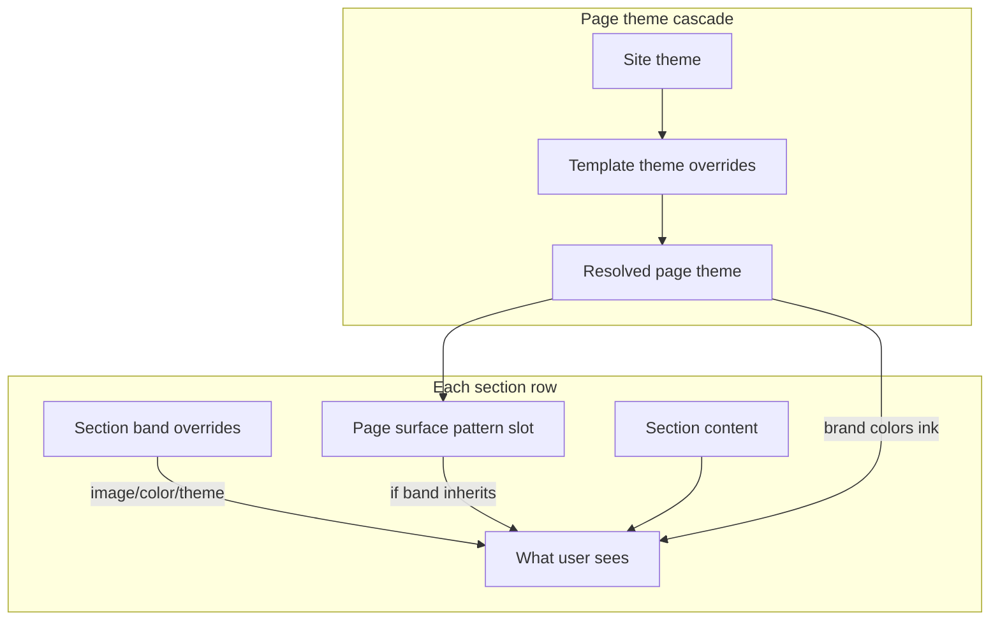

# CMS override guide — priority & how it works

> **In the CMS UI:** open **Themes** (`/cms/site-theme`) for the full **How overrides work** panel, or click **Override guide** on any theme / section band screen.

This guide explains **what wins when** you edit themes, section content, and section bands in SkillHub CMS. Use it when you are unsure whether to change the **site**, a **page template**, or a **single section**.

---

## Quick answer: highest priority first

| Layer | What it controls | Wins over |
|-------|------------------|-----------|
| **1. Section band (per section)** | Background image, background color, light/dark band theme | Page surface pattern |
| **2. Page template theme** | Colors, surface pattern, page background (for that template) | Site theme |
| **3. Site theme (global)** | Default colors, surface pattern, page background | — (base layer) |

For **section text, cards, buttons, and images**, priority depends on **content scope** (see below).

---

## Part 1 — Page theme overrides

Page themes control **brand colors**, **section band patterns**, and **page-level background** (color/image behind transparent sections).

### Cascade (low → high)

```
Site theme (global)
    ↓  empty fields inherit
Page template theme (home, product, course, …)
    ↓  empty fields inherit (entity theme API exists for per-record pages)
Live page appearance
```

**Rule:** Only **non-empty** fields at a higher layer replace the layer below. Empty or “Inherit” means *use the parent*.

### Where to edit

| Goal | Where in CMS |
|------|----------------|
| Change defaults for the whole site | **CMS → Themes → Site theme (global)** |
| Change one template only (e.g. all product pages) | **CMS → Themes → Page template themes**, or **CMS → Pages → [template] → Theme tab** |
| Preview while editing a live entity page | **CMS mode → Theme tab** (saves template theme for that page type) |

### Theme editor tabs

The theme editor has three tabs. All tabs share one **Save** — you can switch tabs and save once.

| Tab | Fields | Inherit behavior (template level) |
|-----|--------|-----------------------------------|
| **Colors** | Preset, Brand, Brand hover, Ink | Empty = use site theme |
| **Surface** | Band pattern (repeat sequence / one color / transparent) | “Inherit” = use site pattern |
| **Background** | Page background color, Page background image URL | Empty = use site background |

### What each theme field does

| Field | Effect on the live page |
|-------|-------------------------|
| **Brand / Brand hover / Ink** | CSS variables (`--brand`, `--ink`, etc.) used across buttons, links, and dark bands |
| **Surface pattern** | Default **section row backgrounds** when a section has no own band override. Builds repeating colors (e.g. white → grey → white → grey) |
| **Page background color / image** | Shows **behind** sections, especially when surface is **Transparent** or between sections |

### Template vs site — examples

- Site: white/grey alternating bands. Product template: **inherit** surface → product pages still alternate white/grey.
- Site: blue brand. Home template: set **Ink** only → home uses custom ink; brand colors still from site unless overridden.
- Template: **Transparent** surface + site page background image → home shows the image between/behind sections.

**Reset template:** Use **“Use site theme only”** / **“Clear template overrides”** to remove all template-level theme fields.

---

## Part 2 — Section band overrides (visual priority)

Each section row can override the page surface pattern for **that row only**.

### Band priority (highest → lowest)

```
1. Section background IMAGE     ← wins everything for that row’s fill
2. Section background COLOR     ← wins over page pattern
3. Section band theme           ← Light / Dark / Inherit
4. Page surface pattern         ← from Site + Template theme (Surface tab)
5. Page background              ← only visible in gaps / transparent surface
```

This matches what you see in the **Section band** editor:

1. **Background image** — full-bleed; replaces default band fill  
2. **Background color** — overrides page surfaces for this section only  
3. **Band theme** — Light or Dark (or Inherit)  
4. **Otherwise** — follows page theme surface pattern  

### Section band theme values

| Value | Meaning |
|-------|---------|
| **Inherit** | Use the page surface pattern for this row (white, grey, custom colors, etc.) |
| **Light** | Force a light band (dark text) regardless of pattern |
| **Dark** | Force a dark band (light text) regardless of pattern |

**Tip:** Use **Inherit** for most sections so the **Surface** tab pattern controls alternation. Use **Light/Dark** only when one row must break the pattern (e.g. a dark CTA between light bands).

### Full-bleed sections

Some section types (e.g. `cta_band`, `in_page_nav`) paint their own layout. The page band wrapper may be skipped or only affect text tokens. If a section looks “self-contained,” check its section type before fighting the surface pattern.

---

## Part 3 — Section content overrides

Section **content** (title, subtitle, items/cards, buttons, images) uses a separate rule: **`content_scope`**.

### Content scope levels

| Scope | Editable on | Locked on |
|-------|-------------|-----------|
| **Global** | Section catalog (`Content sections`) | Template placements & entity pages |
| **Template** | Page template placement | Entity pages (vendor/product/course detail) |
| **Page** | Template placement **and** entity page | — (full cascade) |

Legacy DB value `cascading` is treated as **Page**.

### Content resolution order (for `page` scope)

For each field (title, items, buttons, band image, etc.):

```
Entity page override   (highest — this vendor/product/course only)
    ↓ if empty
Page template placement
    ↓ if empty
Section catalog default
```

For **`template` scope:**

```
Page template placement
    ↓ if empty
Section catalog default
(Entity page cannot change content)
```

For **`global` scope:**

```
Section catalog only
(All templates and entity pages use the same content)
```

### Where to edit content

| Scope | Edit here |
|-------|-----------|
| **Global** | **CMS → Content sections → [section key]** |
| **Template** | **CMS → Pages → [template] → placement**, or template section editor |
| **Page** | Entity CMS mode (gear on live page) for that record |

If editing is blocked, the UI will say content is **global** or **template**-locked and point you to the correct screen.

---

## Part 4 — How it fits together on a live page



**Example — Product detail page:**

1. **Site theme:** Brand blue, surface = white + grey repeat.  
2. **Product template theme:** Inherit everything → still white/grey.  
3. **Hero section:** Band = Inherit → first band = white from pattern.  
4. **Features section:** Band = Inherit → second band = grey.  
5. **Pricing section:** Band background color = `#0f172a` → **dark row** (overrides pattern).  
6. **FAQ items:** `content_scope = template` → same FAQ on all products; edit on product template, not per product.

---

## Part 5 — Decision cheat sheet

| I want to… | Do this |
|------------|---------|
| Change brand color site-wide | Site theme → **Colors** tab |
| Home page only uses a different band pattern | Home template theme → **Surface** tab |
| One section row is always dark | Section → **Section band** → Dark (or custom dark bg color) |
| Alternate custom colors (no code) | Site or template theme → **Surface** → Repeat sequence → add colors |
| Page shows a texture behind all sections | Site or template → **Background** tab |
| Same testimonials on every page | Section catalog + `content_scope: global` |
| Different hero per vendor | `content_scope: page` + edit in that vendor’s CMS mode |
| Reset a template to site defaults | Clear template theme overrides |

---

## Part 6 — Common mistakes

| Mistake | Why it fails | Fix |
|---------|--------------|-----|
| Changed site theme but template has overrides | Template non-empty fields **win** | Clear template field or use Inherit |
| Set surface pattern but section has bg color | Section color is **higher priority** | Remove section bg color or set band to Inherit |
| Edited FAQ on entity page, scope = template | Entity editor is **locked** | Edit on page template placement |
| Expected entity-only theme tab | Per-entity **theme** API exists; live CMS theme tab saves **template** theme | Use template theme for all pages of that type; section-level band for one-off visuals |

---

## Glossary

| Term | Meaning |
|------|---------|
| **Site theme** | Global defaults (`SiteTheme` in DB) |
| **Template theme** | `Page.theme` for a page key (`home`, `product`, …) |
| **Resolved theme** | `mergeTheme(site, template)` — what the page actually uses |
| **Surface pattern** | `surface_pattern` — repeating band colors on section rows |
| **Placement** | One section instance on a page template |
| **Entity override** | `EntityPageSection` — per vendor/product/course changes |
| **content_scope** | Whether content is global, template-only, or per-entity |

---

## Related files (for developers)

| Area | Code |
|------|------|
| Theme merge | `server/src/modules/cms/theme.utils.js` → `mergeTheme()` |
| Section band priority | `client/src/lib/sections/section-band-cms.ts` |
| Surface pattern | `client/src/lib/theme/surface-patterns.ts` |
| Content scope | `client/src/lib/cms/content-scope.ts` |
| Placement merge | `client/src/components/cms/pages/live/merge-placements.ts` → `mergePlacements()` |
| Live-edit placements | `client/src/context/CmsLivePlacementsContext.tsx` |
| Theme editor UI | `client/src/context/CmsThemeEditorContext.tsx` |

---

*Last updated for the tabbed theme editor (Colors / Surface / Background) and custom `surface_pattern` builder.*
